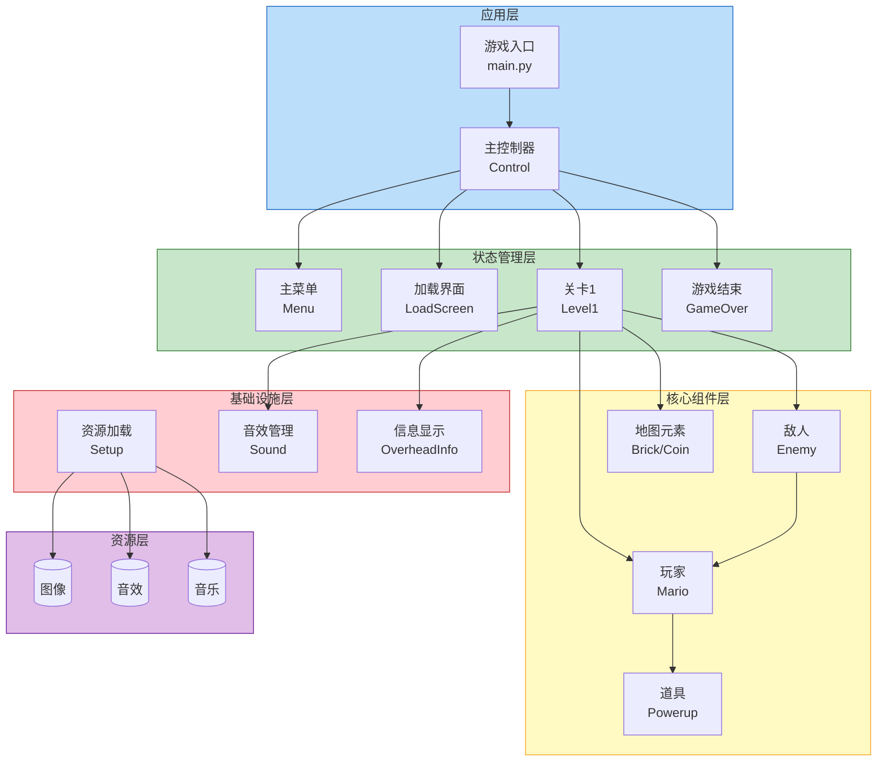
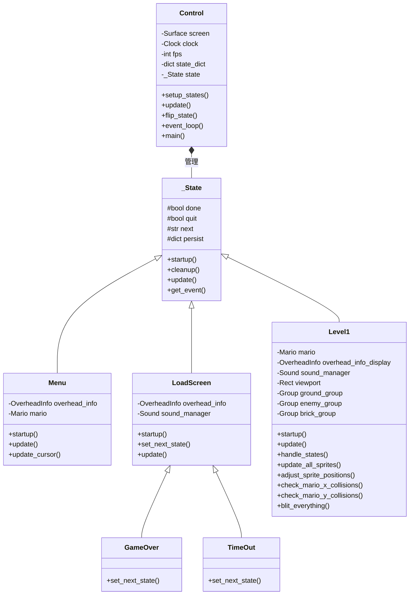
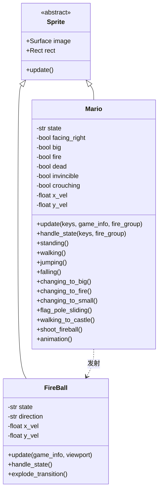
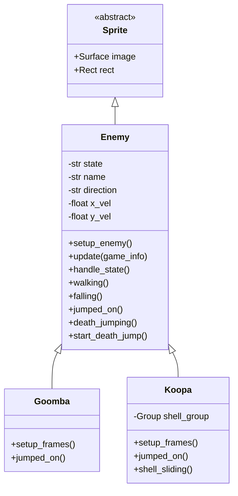
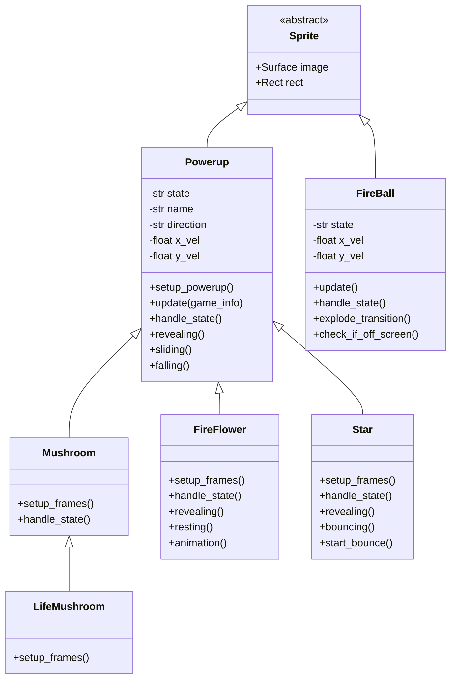
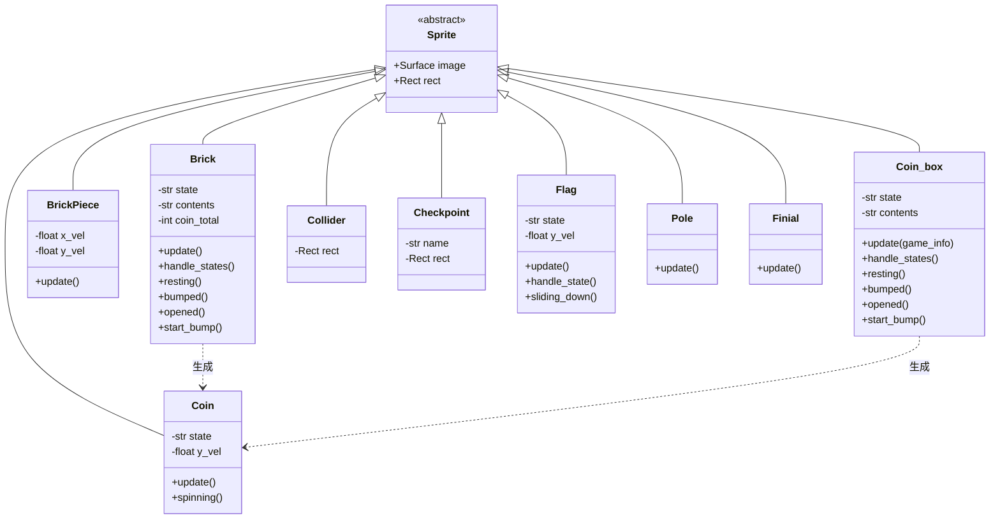
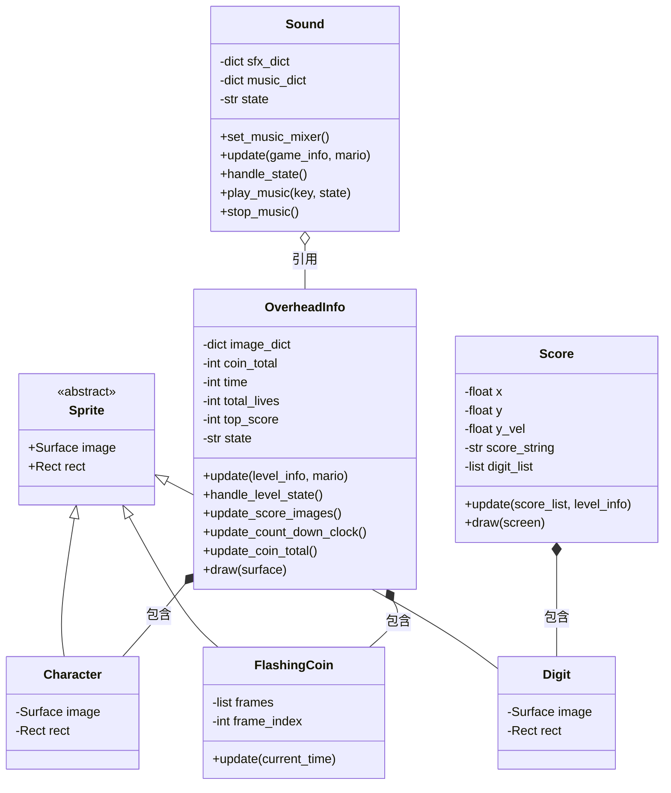

**概要设计说明书**

基于Pygame的超级马里奥游戏开发


项目名称：基于Pygame的超级马里奥游戏开发

文档版本：V3.0

编写日期：2026年6月23日

编写人员：黄昊哲


2026年6月23日


概要设计说明书

项目名称：基于Pygame的超级马里奥游戏开发

文档版本：V3.0

编写日期：2026年6月23日

# 一、引言

## 1.1 目的

本文档旨在描述超级马里奥游戏的系统架构、模块设计、接口设计和数据结构设计，为详细设计和编码实现提供依据。

## 1.2 设计策略

• 核心策略：模块化架构 + 优质资源整合

• 架构层：采用分层架构设计，组件/状态分离

• 素材层：整合优质游戏资源（图片、音乐、音效）

• 逻辑层：结合两者优势，确保游戏体验和代码质量

# 二、系统架构设计

## 2.1 整体架构图



## 2.2 模块划分


| 模块 | 文件 | 职责 |
| --- | --- | --- |
| 控制模块 | main.py | 主入口 + 游戏循环 |
|  | setup.py | 初始化 + 资源加载 |
|  | tools.py | 控制器 + 工具函数 |
|  | constants.py | 常量定义 |
| 组件模块 | mario.py | 玩家角色 |
|  | enemies.py | 敌人系统（Goomba、Koopa） |
|  | bricks.py | 砖块（Brick、BrickPiece） |
|  | coin_box.py | 问号方块 |
|  | powerups.py | 道具系统（Mushroom、FireFlower、Star、FireBall） |
|  | coin.py | 金币 |
|  | collider.py | 碰撞体（地面、管道、台阶） |
|  | checkpoint.py | 检查点 |
|  | flagpole.py | 旗杆（Flag、Pole、Finial） |
|  | info.py | 信息显示（OverheadInfo、Character） |
|  | score.py | 分数系统（Score、Digit） |
|  | flashing_coin.py | 闪烁金币 |
|  | castle_flag.py | 城堡旗帜 |
| 状态模块 | main_menu.py | 主菜单状态 |
|  | load_screen.py | 加载/过渡状态（LoadScreen、GameOver、TimeOut） |
|  | level1.py | 游戏关卡状态 |
| 工具模块 | game_sound.py | 音效管理 |

## 2.3 目录结构

data/

├── main.py              # 游戏入口

├── setup.py             # 初始化和资源加载

├── tools.py             # 控制器和工具函数

├── constants.py         # 常量定义

├── game_sound.py        # 音效管理

├── components/          # 游戏组件

│   ├── mario.py         # 玩家角色

│   ├── enemies.py       # 敌人系统

│   ├── bricks.py        # 砖块系统

│   ├── coin_box.py      # 问号方块

│   ├── powerups.py      # 道具系统

│   ├── coin.py          # 金币

│   ├── collider.py      # 碰撞体

│   ├── checkpoint.py    # 检查点

│   ├── flagpole.py      # 旗杆

│   ├── info.py          # 信息显示

│   ├── score.py         # 分数系统

│   ├── flashing_coin.py # 闪烁金币

│   └── castle_flag.py   # 城堡旗帜

└── states/              # 游戏状态

├── main_menu.py     # 主菜单

├── load_screen.py   # 加载界面

└── level1.py        # 关卡1

# 三、核心类设计

## 3.1 类关系图














## 3.2 核心类定义

## 3.2.1 Control类（控制器）

职责：管理游戏主循环和状态切换


| 属性/方法 | 类型 | 说明 |
| --- | --- | --- |
| screen | Surface | 游戏屏幕 |
| clock | Clock | 时钟对象 |
| fps | int | 帧率（60） |
| current_time | float | 当前游戏时间 |
| keys | dict | 当前按键状态 |
| state_dict | dict | 状态字典 |
| state_name | str | 当前状态名称 |
| state | _State | 当前状态对象 |
| done | bool | 游戏是否结束 |
| setup_states(state_dict, start_state) | method | 初始化状态机 |
| update() | method | 更新当前状态 |
| flip_state() | method | 切换到下一个状态 |
| event_loop() | method | 处理pygame事件 |
| main() | method | 主游戏循环 |

## 3.2.2 _State类（状态基类）

职责：定义所有游戏状态的通用接口


| 属性/方法 | 类型 | 说明 |
| --- | --- | --- |
| start_time | float | 状态开始时间 |
| current_time | float | 当前时间 |
| done | bool | 状态是否结束 |
| quit | bool | 是否退出游戏 |
| next | str | 下一个状态名称 |
| previous | str | 上一个状态名称 |
| persist | dict | 持久化数据 |
| startup(current_time, persistant) | method | 状态启动时调用 |
| cleanup() | method | 状态结束时调用 |
| update(surface, keys, current_time) | method | 每帧更新 |
| get_event(event) | method | 处理单个事件 |

## 3.2.3 Mario类（玩家角色）

职责：管理玩家的状态、移动、动画、碰撞


| 属性/方法 | 类型 | 说明 |
| --- | --- | --- |
| sprite_sheet | SpriteSheet | 精灵表 |
| state | str | 当前状态 |
| image | Surface | 当前图像 |
| rect | Rect | 碰撞矩形 |
| facing_right | bool | 朝向右方 |
| big | bool | 是否大形态 |
| fire | bool | 是否火焰形态 |
| dead | bool | 是否死亡 |
| invincible | bool | 是否无敌 |
| x_vel, y_vel | float | 水平/垂直速度 |
| update(keys, game_info, fire_group) | method | 每帧更新 |
| handle_state(keys, fire_group) | method | 状态机处理 |
| standing() | method | 站立状态 |
| walking() | method | 行走状态 |
| jumping() | method | 跳跃状态 |
| falling() | method | 下落状态 |
| changing_to_big() | method | 小变大过渡 |
| changing_to_fire() | method | 大变火焰过渡 |
| changing_to_small() | method | 大变小过渡 |
| flag_pole_sliding() | method | 旗杆滑下 |
| walking_to_castle() | method | 走向城堡 |
| shoot_fireball() | method | 发射火球 |
| animation() | method | 动画帧更新 |

## 3.2.4 Enemy类（敌人基类）

职责：管理敌人的状态、移动、动画


| 属性/方法 | 类型 | 说明 |
| --- | --- | --- |
| state | str | 当前状态（WALK/FALL/JUMPED_ON/DEATH_JUMP） |
| name | str | 敌人类型（goomba/koopa） |
| direction | str | 移动方向（LEFT/RIGHT） |
| x_vel, y_vel | float | 水平/垂直速度 |
| setup_enemy() | method | 初始化敌人 |
| update(game_info) | method | 每帧更新 |
| handle_state() | method | 状态机处理 |
| walking() | method | 巡逻状态 |
| jumped_on() | method | 被踩踏 |
| death_jumping() | method | 死亡跳跃 |

## 3.2.5 Goomba类（栗子怪）


| 属性/方法 | 类型 | 说明 |
| --- | --- | --- |
| setup_frames() | method | 设置动画帧 |
| jumped_on() | method | 被踩扁状态 |

## 3.2.6 Koopa类（乌龟）


| 属性/方法 | 类型 | 说明 |
| --- | --- | --- |
| shell_group | Group | 龟壳组引用 |
| setup_frames() | method | 设置动画帧 |
| jumped_on() | method | 进入龟壳状态 |
| shell_sliding() | method | 龟壳滑动状态 |

## 3.2.7 Powerup类（道具基类）


| 属性/方法 | 类型 | 说明 |
| --- | --- | --- |
| state | str | 当前状态（REVEAL/SLIDE/FALL） |
| name | str | 道具类型 |
| setup_powerup() | method | 初始化道具 |
| update(game_info) | method | 每帧更新 |
| handle_state() | method | 状态机处理 |
| revealing() | method | 从方块中出现 |
| sliding() | method | 滑动状态 |
| falling() | method | 下落状态 |

## 3.2.8 道具子类


| 类名 | 父类 | 职责 |
| --- | --- | --- |
| Mushroom | Powerup | 蘑菇道具，小变大 |
| LifeMushroom | Mushroom | 1UP蘑菇，增加生命 |
| FireFlower | Powerup | 火焰花，大变火焰 |
| Star | Powerup | 无敌星，获得无敌 |
| FireBall | Sprite | 火球，火焰马里奥发射 |

## 3.2.9 Brick类（砖块）


| 属性/方法 | 类型 | 说明 |
| --- | --- | --- |
| state | str | 当前状态（RESTING/BUMPED/OPENED） |
| contents | str | 内容物（None/6coins/star） |
| update() | method | 每帧更新 |
| handle_states() | method | 状态机处理 |
| start_bump() | method | 开始撞击动画 |

## 3.2.10 Coin_box类（问号方块）


| 属性/方法 | 类型 | 说明 |
| --- | --- | --- |
| state | str | 当前状态（RESTING/BUMPED/OPENED） |
| contents | str | 内容物（coin/mushroom/fireflower/1up_mushroom） |
| update(game_info) | method | 每帧更新 |
| handle_states() | method | 状态机处理 |
| start_bump() | method | 开始撞击动画 |

## 3.2.11 Level1类（关卡状态）

职责：管理关卡中的所有元素和游戏逻辑


| 属性/方法 | 类型 | 说明 |
| --- | --- | --- |
| game_info | dict | 游戏信息字典 |
| state | str | 关卡状态（FROZEN/NOT_FROZEN/IN_CASTLE/FLAG_AND_FIREWORKS） |
| mario | Mario | 玩家对象 |
| viewport | Rect | 摄像机视口 |
| ground_group | Group | 地面碰撞组 |
| pipe_group | Group | 管道碰撞组 |
| brick_group | Group | 砖块组 |
| coin_box_group | Group | 问号箱组 |
| enemy_group | Group | 活跃敌人组 |
| coin_group | Group | 金币组 |
| powerup_group | Group | 道具组 |
| shell_group | Group | 龟壳组 |
| check_point_group | Group | 检查点组 |
| update() | method | 每帧更新 |
| handle_states() | method | 关卡状态处理 |
| adjust_sprite_positions() | method | 调整精灵位置 |
| check_mario_x_collisions() | method | X轴碰撞检测 |
| check_mario_y_collisions() | method | Y轴碰撞检测 |
| blit_everything() | method | 渲染画面 |

## 3.2.12 辅助类


| 类名 | 文件 | 职责 |
| --- | --- | --- |
| Collider | collider.py | 碰撞体（地面、管道、台阶） |
| Checkpoint | checkpoint.py | 检查点触发器 |
| Flag | flagpole.py | 旗帜 |
| Pole | flagpole.py | 旗杆 |
| Finial | flagpole.py | 旗杆顶部装饰 |
| OverheadInfo | info.py | HUD信息显示 |
| Character | info.py | 文字精灵 |
| Score | score.py | 浮动分数显示 |
| Digit | score.py | 数字精灵 |
| Sound | game_sound.py | 音效管理器 |

# 四、核心系统设计

## 4.1 游戏状态机

```mermaid
stateDiagram-v2
    [*] --> MAIN_MENU : 启动游戏

    state MAIN_MENU {
        note right of MAIN_MENU
            主菜单
            - 显示游戏标题
            - 显示"1 PLAYER GAME"
            - 上下键选择，Enter/A/S确认
        end note
    }

    state LOAD_SCREEN {
        note right of LOAD_SCREEN
            加载界面
            - 显示"WORLD 1-1"
            - 显示生命数
            - 等待3秒
        end note
    }

    state LEVEL1 {
        state "FROZEN" as Frozen
        state "NOT_FROZEN" as NotFrozen
        state "IN_CASTLE" as InCastle
        state "FLAG_AND_FIREWORKS" as FlagFireworks

        [*] --> NotFrozen
        NotFrozen --> Frozen : 过场动画
        Frozen --> NotFrozen : 动画结束
        NotFrozen --> FlagFireworks : 到达旗杆
        FlagFireworks --> InCastle : 旗杆动画完成
    }

    state GAME_OVER {
        note right of GAME_OVER
            游戏结束
            - 显示"GAME OVER"
            - 按键返回主菜单
        end note
    }

    state TIME_OUT {
        note right of TIME_OUT
            时间耗尽
            - 显示"TIME UP"
            - 减少生命
        end note
    }

    state "道具状态" as PowerupState {
        state "普通" as Normal
        state "超级" as Super
        state "火焰" as Fire

        [*] --> Normal
        Normal --> Super : 吃蘑菇
        Super --> Fire : 吃火焰花
        Fire --> Normal : 受伤
        Super --> Normal : 受伤
    }

    MAIN_MENU --> LOAD_SCREEN : 按Enter/A/S
    LOAD_SCREEN --> LEVEL1 : 加载完成

    LEVEL1 --> TIME_OUT : 时间归零
    LEVEL1 --> GAME_OVER : 生命归零

    TIME_OUT --> GAME_OVER : 无剩余生命
    TIME_OUT --> LOAD_SCREEN : 有剩余生命

    InCastle --> LOAD_SCREEN : 进入下一关

    GAME_OVER --> MAIN_MENU : 按键返回
```

## 4.2 物理系统


| 常量 | 值 | 说明 |
| --- | --- | --- |
| GRAVITY | 1.01 | 正常重力 |
| JUMP_GRAVITY | 0.31 | 跳跃时重力 |
| JUMP_VEL | -10 | 跳跃初速度 |
| FAST_JUMP_VEL | -12.5 | 快速跳跃初速度 |
| MAX_Y_VEL | 11 | 最大下落速度 |
| MAX_WALK_SPEED | 6 | 最大行走速度 |
| MAX_RUN_SPEED | 800 | 最大奔跑速度 |
| WALK_ACCEL | 0.15 | 行走加速度 |
| RUN_ACCEL | 20 | 奔跑加速度 |
| SMALL_TURNAROUND | 0.35 | 转向减速 |

## 4.3 碰撞检测系统

```mermaid
flowchart TD
    Start(["游戏主循环开始"])
    Start --> A["更新所有精灵位置"]

    subgraph X轴碰撞检测
        A --> B["移动马里奥X坐标"]
        B --> C{"与地面/管道/台阶碰撞?"}
        C -->|是| D["调整X位置"]
        C -->|否| E{"与砖块碰撞?"}
        D --> E

        E -->|是| F{"从下方撞击?"}
        F -->|是| G["砖块弹跳<br/>生成内容物"]
        F -->|否| H["调整X位置"]
        E -->|否| I{"与问号箱碰撞?"}

        G --> I
        H --> I

        I -->|是| J{"从下方撞击?"}
        J -->|是| K["方块弹跳<br/>生成道具/金币"]
        J -->|否| L["调整X位置"]
        I -->|否| M{"与敌人碰撞?"}

        K --> M
        L --> M

        M -->|是| N{"无敌状态?"}
        N -->|是| O["敌人死亡"]
        N -->|否| P["马里奥受伤"]
        M -->|否| Q["继续"]
        O --> Q
        P --> Q
    end

    subgraph Y轴碰撞检测
        Q --> R["移动马里奥Y坐标"]
        R --> S{"与地面碰撞?"}
        S -->|是| T["马里奥着地"]
        S -->|否| U["下落状态"]

        T --> V{"与砖块/问号箱碰撞?"}
        U --> V

        V -->|是| W{"从上方踩踏?"}
        W -->|是| X["站在上面"]
        W -->|否| Y{"从下方撞击?"}
        Y -->|是| Z["触发弹跳"]
        Y -->|否| AA["继续"]
        V -->|否| AB{"与敌人碰撞?"}

        X --> AB
        Z --> AB
        AA --> AB

        AB -->|是| AC{"从上方踩踏?"}
        AC -->|是| AD["敌人被踩扁<br/>马里奥反弹"]
        AC -->|否| AE["马里奥受伤"]
        AB -->|否| AF["继续"]
        AD --> AF
        AE --> AF
    end

    subgraph 敌人碰撞检测
        AF --> AG["遍历所有敌人"]
        AG --> AH["更新敌人位置"]
        AH --> AI{"与地面碰撞?"}
        AI -->|是| AJ["敌人着地"]
        AI -->|否| AK["敌人下落"]
        AJ --> AL{"与管道碰撞?"}
        AK --> AL
        AL -->|是| AM["敌人转向"]
        AL -->|否| AN["继续"]
        AM --> AN
    end

    subgraph 道具碰撞检测
        AN --> AO["遍历所有道具"]
        AO --> AP["更新道具位置"]
        AP --> AQ{"与马里奥碰撞?"}
        AQ -->|是| AR{"道具类型?"}
        AR -->|蘑菇| AS["马里奥变大"]
        AR -->|火焰花| AT["获得火焰能力"]
        AR -->|星星| AU["获得无敌"]
        AR -->|1UP| AV["增加生命"]
        AS --> AW["移除道具"]
        AT --> AW
        AU --> AW
        AV --> AW
        AQ -->|否| AX{"出界?"}
        AW --> AX
        AX -->|是| AY["移除道具"]
        AX -->|否| AZ["继续"]
        AY --> AZ
    end

    AZ --> BA["渲染画面"]
    BA --> BB(["循环结束"])

    style Start fill:#4caf50,color:white
    style BB fill:#f44336,color:white
```



碰撞检测采用AABB算法，分X轴和Y轴两次检测：

## 1. X轴碰撞：检测马里奥与地面、管道、台阶、砖块、问号箱、敌人的水平碰撞

## 2. Y轴碰撞：检测马里奥与地面、砖块、问号箱、敌人的垂直碰撞

## 3. 踩踏判定：马里奥y_vel > 0且碰撞位置在敌人上方时判定为踩踏

## 4.4 动画系统


| 角色 | 动画 | 帧数 |
| --- | --- | --- |
| 马里奥（小） | 站立/行走/跳跃/死亡 | 1/4/1/1 |
| 马里奥（大） | 站立/行走/跳跃/蹲下 | 1/4/1/1 |
| 栗子怪 | 行走/踩扁/死亡 | 2/1/1 |
| 乌龟 | 行走/龟壳/滑动 | 2/1/1 |

# 五、接口设计

## 5.1 按键绑定


| 按键 | 功能 | 说明 |
| --- | --- | --- |
| A键 | 跳跃 | 按住时间越长跳得越高 |
| S键 | 动作/火球 | 火焰形态时发射火球 |
| 左方向键 | 向左移动 |  |
| 右方向键 | 向右移动 |  |
| 下方向键 | 蹲下 | 大马里奥状态下有效 |
| Enter键 | 确认 | 菜单选择 |
| ESC键 | 退出 | 退出游戏 |

## 5.2 数据接口（game_info字典）


| 键名 | 类型 | 说明 |
| --- | --- | --- |
| COIN_TOTAL | int | 当前金币数 |
| SCORE | int | 当前分数 |
| TOP_SCORE | int | 最高分 |
| LIVES | int | 剩余生命 |
| CURRENT_TIME | float | 当前时间 |
| LEVEL_STATE | str | 关卡状态 |
| MARIO_DEAD | bool | 马里奥是否死亡 |

# 六、算法设计

## 6.1 摄像机跟随算法

摄像机跟随玩家移动，保持玩家在屏幕1/3位置。

## 6.2 敌人AI算法

敌人使用简单的巡逻AI，碰到墙壁或管道时转向。

## 6.3 踩踏检测算法

踩踏检测基于碰撞位置和速度：马里奥y_vel > 0且碰撞位置在敌人上方。

## 6.4 道具生成算法

问号方块和砖块根据contents类型生成对应道具。大马里奥时蘑菇转换为火焰花。

# 七、资源管理设计

## 7.1 资源目录结构


| 目录 | 文件 | 说明 |
| --- | --- | --- |
| resources/fonts/ | Fixedsys500c.ttf | 游戏字体 |
| resources/graphics/ | mario_bros.png | 玩家精灵表 |
|  | enemies.png | 敌人精灵表 |
|  | tile_set.png | 地形瓦片 |
|  | item_objects.png | 道具精灵表 |
|  | level_1.png | 关卡背景 |
|  | title_screen.png | 标题画面 |
| resources/music/ | main_theme.ogg | 主题曲 |
|  | invincible.ogg | 无敌音乐 |
|  | game_over.ogg | 游戏结束音乐 |
|  | stage_clear.ogg | 过关音乐 |
| resources/sound/ | big_jump.ogg | 大跳跃音效 |
|  | small_jump.ogg | 小跳跃音效 |
|  | coin.ogg | 金币音效 |
|  | stomp.ogg | 踩踏音效 |
|  | powerup.ogg | 道具音效 |
|  | brick_smash.ogg | 砖块碎裂音效 |
|  | fireball.ogg | 火球音效 |

# 八、数据结构设计

## 8.1 游戏状态定义

Mario状态


| 常量 | 值 | 说明 |
| --- | --- | --- |
| STAND | standing | 站立 |
| WALK | walk | 行走 |
| JUMP | jump | 跳跃 |
| FALL | fall | 下落 |
| SMALL_TO_BIG | small to big | 小变大过渡 |
| BIG_TO_FIRE | big to fire | 大变火焰过渡 |
| BIG_TO_SMALL | big to small | 大变小过渡 |
| FLAGPOLE | flag pole | 旗杆上 |
| WALKING_TO_CASTLE | walking to castle | 走向城堡 |

敌人状态


| 常量 | 值 | 说明 |
| --- | --- | --- |
| LEFT | left | 向左移动 |
| RIGHT | right | 向右移动 |
| JUMPED_ON | jumped on | 被踩踏 |
| DEATH_JUMP | death jump | 死亡跳跃 |
| SHELL_SLIDE | shell slide | 龟壳滑动 |

关卡状态


| 常量 | 值 | 说明 |
| --- | --- | --- |
| FROZEN | frozen | 冻结 |
| NOT_FROZEN | not frozen | 正常游戏 |
| IN_CASTLE | in castle | 进入城堡 |
| FLAG_AND_FIREWORKS | flag and fireworks | 旗杆和烟花 |

# 九、开发计划


| 里程碑 | 任务 | 时间 | 交付物 |
| --- | --- | --- | --- |
| M1 | 基础框架搭建 | 2天 | 游戏主循环、状态机、资源加载 |
| M2 | 玩家系统实现 | 2天 | 移动、跳跃、动画、状态 |
| M3 | 关卡系统实现 | 2天 | 地形、碰撞、摄像机 |
| M4 | 敌人系统实现 | 2天 | 敌人AI、碰撞、死亡 |
| M5 | 道具和UI实现 | 2天 | 道具系统、UI、音效 |

# 十、附录

A. 变更记录


| 版本 | 日期 | 变更内容 |
| --- | --- | --- |
| V1.0 | 2026-06-23 | 初始版本 |
| V2.0 | 2026-06-24 | 补充UML类图、接口设计 |


| V3.0 | 2026-06-24 | 修正文件名、补充完整类定义和状态 |

