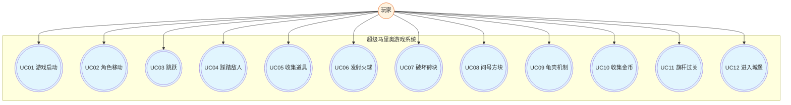

**软件需求规格说明书**

基于Pygame的超级马里奥游戏开发

项目名称：基于Pygame的超级马里奥游戏开发

文档版本：V2.0

编写日期：2026年6月23日

编写人员：黄昊哲

2026年6月23日

软件需求规格说明书

项目名称：基于Pygame的超级马里奥游戏开发

文档版本：V2.0

编写日期：2026年6月23日

# 一、引言

## 1.1 目的

本文档旨在定义超级马里奥游戏的功能需求、性能需求和接口需求。

## 1.2 项目背景

本项目基于Pygame框架开发超级马里奥第一关复刻版，采用模块化架构设计。

# 二、总体描述

## 2.1 产品概述

超级马里奥是一款2D横版卷轴游戏，玩家控制马里奥角色，通过跳跃、踩踏敌人、收集道具等方式完成关卡。

## 2.2 用户特征

目标用户为熟悉经典马里奥游戏的玩家，具备基本的键盘操作能力。

## 2.3 运行环境

• 操作系统：Windows 10/11

• Python版本：3.12

• Pygame版本：2.x

• 屏幕分辨率：800×600

# 三、功能需求

## 3.1 功能列表

## 3.1.1 游戏启动与菜单系统

| 功能 | 优先级 | 描述 |
| --- | --- | --- |
| 启动游戏 | P0 | 应用程序启动，显示主菜单界面 |
| 菜单导航 | P0 | 上下方向键移动光标选择选项 |
| 开始游戏 | P0 | 按Enter键开始1 PLAYER GAME |
| 退出游戏 | P1 | 按ESC键退出游戏 |

## 3.1.2 角色控制系统

| 功能 | 优先级 | 描述 |
| --- | --- | --- |
| 左右移动 | P0 | 方向键控制马里奥左右移动 |
| 奔跑 | P1 | 按住S键加速移动 |
| 跳跃 | P0 | 按A键跳跃，支持高度控制 |
| 蹲下 | P1 | 大马里奥状态下按向下方向键蹲下 |

## 3.1.3 战斗系统

| 功能 | 优先级 | 描述 |
| --- | --- | --- |
| 踩踏敌人 | P0 | 从上方踩踏敌人使其死亡 |
| 发射火球 | P1 | 火焰马里奥状态下按S键发射火球 |
| 龟壳机制 | P1 | 踩踏乌龟变龟壳，可踢动龟壳消灭敌人 |
| 无敌状态 | P2 | 收集星星后获得10秒无敌 |
| 受伤处理 | P0 | 大马里奥受伤变小，小马里奥受伤死亡 |

## 3.1.4 道具系统

| 功能 | 优先级 | 描述 |
| --- | --- | --- |
| 蘑菇 | P1 | 小马里奥变大马里奥 |
| 火焰花 | P1 | 大马里奥变火焰马里奥 |
| 星星 | P2 | 获得10秒无敌状态 |
| 1UP蘑菇 | P2 | 增加一条生命 |
| 金币 | P0 | 收集金币增加分数 |

## 3.1.5 关卡交互系统

| 功能 | 优先级 | 描述 |
| --- | --- | --- |
| 问号方块 | P0 | 从下方顶问号方块获得道具或金币 |
| 砖块破坏 | P1 | 大马里奥从下方顶砖块可破坏 |
| 旗杆过关 | P0 | 到达旗杆处触发过关动画 |
| 城堡进入 | P0 | 过关后走向城堡完成关卡 |

## 3.1.6 敌人系统

| 功能 | 优先级 | 描述 |
| --- | --- | --- |
| 栗子怪巡逻 | P0 | 栗子怪左右移动，遇障碍转向 |
| 乌龟巡逻 | P0 | 乌龟左右移动，可被踩成龟壳 |
| 敌人生成 | P1 | 到达检查点时从右侧生成敌人 |

## 3.1.7 界面与显示系统

| 功能 | 优先级 | 描述 |
| --- | --- | --- |
| 主菜单显示 | P0 | 显示游戏标题、选项 |
| 分数显示 | P0 | 实时显示当前分数 |
| 金币计数 | P0 | 显示当前金币数量 |
| 生命显示 | P0 | 显示剩余生命数 |
| 倒计时 | P0 | 关卡时间倒计时 |
| 摄像机跟随 | P0 | 视角跟随马里奥移动 |

## 3.1.8 音效系统

| 功能 | 优先级 | 描述 |
| --- | --- | --- |
| 背景音乐 | P1 | 游戏进行中播放主题音乐 |
| 无敌音乐 | P1 | 无敌状态时播放特殊音乐 |
| 加速音乐 | P1 | 时间不足100秒时音乐加速 |
| 死亡音效 | P0 | 马里奥死亡时播放死亡音效 |
| 过关音效 | P0 | 到达旗杆时播放过关音效 |

## 3.2 用例图

## 3.3 用例描述

### 用例UC01：游戏启动与菜单选择

| 项目 | 描述 |
| --- | --- |
| 用例名称 | 游戏启动与菜单选择 |
| 用例编号 | UC01 |
| 参与者 | 玩家 |
| 前置条件 | 应用程序已启动 |
| 后置条件 | 进入关卡加载界面 |
| 基本流程 | 1. 玩家启动应用程序
2. 系统显示主菜单
3. 玩家按Enter键选择
4. 系统显示加载画面
5. 进入第一关 |
| 异常流程 | 按ESC键退出游戏 |

### 用例UC02：角色移动控制

| 项目 | 描述 |
| --- | --- |
| 用例名称 | 角色移动控制 |
| 用例编号 | UC02 |
| 参与者 | 玩家 |
| 前置条件 | 游戏进行中 |
| 后置条件 | 角色位置更新 |
| 基本流程 | 1. 玩家按左/右方向键
2. 系统设置角色速度
3. 角色进入WALK状态
4. 系统更新位置
5. 系统检测碰撞 |
| 异常流程 | 碰撞到障碍物：角色停止 |

### 用例UC03：跳跃

| 项目 | 描述 |
| --- | --- |
| 用例名称 | 跳跃 |
| 用例编号 | UC03 |
| 参与者 | 玩家 |
| 前置条件 | 角色在地面上 |
| 后置条件 | 角色离开地面 |
| 基本流程 | 1. 玩家按A键
2. 系统设置跳跃速度
3. 角色进入JUMP状态
4. 系统应用重力
5. 角色落地 |
| 异常流程 | 头顶碰障碍物：立即下落 |

### 用例UC04：踩踏敌人

| 项目 | 描述 |
| --- | --- |
| 用例名称 | 踩踏敌人 |
| 用例编号 | UC04 |
| 参与者 | 玩家 |
| 前置条件 | 敌人在玩家下方 |
| 后置条件 | 敌人死亡，玩家反弹 |
| 基本流程 | 1. 角色从上方落下
2. 碰撞检测触发
3. 系统判断正在下落
4. 敌人死亡
5. 玩家反弹+100分 |
| 异常流程 | 从侧面碰撞：玩家受伤 |

### 用例UC05：收集道具

| 项目 | 描述 |
| --- | --- |
| 用例名称 | 收集道具 |
| 用例编号 | UC05 |
| 参与者 | 玩家 |
| 前置条件 | 道具存在于场景中 |
| 后置条件 | 玩家获得道具效果 |
| 基本流程 | 1. 角色接触道具
2. 系统判断道具类型
3. 应用效果（变大/变火焰/无敌/加命）
4. 道具移除
5. +1000分 |
| 异常流程 | 大马里奥收集蘑菇：转换为火焰花 |

### 用例UC06：发射火球

| 项目 | 描述 |
| --- | --- |
| 用例名称 | 发射火球 |
| 用例编号 | UC06 |
| 参与者 | 玩家 |
| 前置条件 | 角色为火焰马里奥 |
| 后置条件 | 火球被创建 |
| 基本流程 | 1. 按S键
2. 检查火球数量<2
3. 创建火球
4. 火球飞行
5. 碰撞检测 |
| 异常流程 | 已有2个火球：不创建 |

### 用例UC07：破坏砖块

| 项目 | 描述 |
| --- | --- |
| 用例名称 | 破坏砖块 |
| 用例编号 | UC07 |
| 参与者 | 玩家 |
| 前置条件 | 砖块存在 |
| 后置条件 | 砖块状态改变 |
| 基本流程 | 1. 从下方撞击
2. 判断大马里奥
3. 砖块碎裂
4. +50分 |
| 异常流程 | 小马里奥：仅弹起 |

### 用例UC08：使用问号方块

| 项目 | 描述 |
| --- | --- |
| 用例名称 | 使用问号方块 |
| 用例编号 | UC08 |
| 参与者 | 玩家 |
| 前置条件 | 问号方块存在 |
| 后置条件 | 方块变为OPENED |
| 基本流程 | 1. 从下方撞击
2. 方块弹起
3. 生成内容物
4. 方块外观改变 |
| 异常流程 | 已打开：无效果 |

### 用例UC09：龟壳机制

| 项目 | 描述 |
| --- | --- |
| 用例名称 | 龟壳机制 |
| 用例编号 | UC09 |
| 参与者 | 玩家 |
| 前置条件 | 乌龟已成壳 |
| 后置条件 | 龟壳开始滑动 |
| 基本流程 | 1. 接触静止龟壳
2. 龟壳滑动
3. 可消灭敌人
4. +100分/敌人 |
| 异常流程 | 接触滑动龟壳：受伤 |

### 用例UC10：收集金币

| 项目 | 描述 |
| --- | --- |
| 用例名称 | 收集金币 |
| 用例编号 | UC10 |
| 参与者 | 玩家 |
| 前置条件 | 金币存在 |
| 后置条件 | 金币被收集 |
| 基本流程 | 1. 接触金币
2. 金币移除
3. +200分
4. 计数+1 |
| 异常流程 | 100枚：加一条命 |

### 用例UC11：旗杆过关

| 项目 | 描述 |
| --- | --- |
| 用例名称 | 旗杆过关 |
| 用例编号 | UC11 |
| 参与者 | 玩家 |
| 前置条件 | 到达旗杆 |
| 后置条件 | 过关序列开始 |
| 基本流程 | 1. 触碰旗杆
2. 滑下旗杆
3. 根据高度得分
4. 走向城堡 |
| 异常流程 | 未触碰：无效果 |

### 用例UC12：进入城堡

| 项目 | 描述 |
| --- | --- |
| 用例名称 | 进入城堡 |
| 用例编号 | UC12 |
| 参与者 | 系统 |
| 前置条件 | 已滑下旗杆 |
| 后置条件 | 关卡结束 |
| 基本流程 | 1. 走向城堡
2. 时间转分数
3. 城堡旗帜升起
4. 播放音乐 |
| 异常流程 | 时间已归零：无奖励 |

### 用例UC13：角色受伤与死亡

| 项目 | 描述 |
| --- | --- |
| 用例名称 | 角色受伤与死亡 |
| 用例编号 | UC13 |
| 参与者 | 系统 |
| 前置条件 | 与敌人碰撞 |
| 后置条件 | 状态改变或死亡 |
| 基本流程 | 1. 碰撞触发
2. 大马里奥：变小+无敌
3. 小马里奥：死亡
4. 生命-1 |
| 异常流程 | 无敌状态：无伤害 |

### 用例UC14：时间管理

| 项目 | 描述 |
| --- | --- |
| 用例名称 | 时间管理 |
| 用例编号 | UC14 |
| 参与者 | 系统 |
| 前置条件 | 关卡进行中 |
| 后置条件 | 时间影响游戏 |
| 基本流程 | 1. 倒计时-1/秒
2. 100秒：加速音乐
3. 0秒：角色死亡 |
| 异常流程 | 过关前：时间转分数 |

### 用例UC15：无敌状态

| 项目 | 描述 |
| --- | --- |
| 用例名称 | 无敌状态 |
| 用例编号 | UC15 |
| 参与者 | 系统 |
| 前置条件 | 收集星星 |
| 后置条件 | 10秒无敌 |
| 基本流程 | 1. 收集星星
2. 颜色循环
3. 消灭敌人
4. 10秒后恢复 |
| 异常流程 | 死亡：无敌结束 |

### 用例UC16：蹲下机制

| 项目 | 描述 |
| --- | --- |
| 用例名称 | 蹲下机制 |
| 用例编号 | UC16 |
| 参与者 | 玩家 |
| 前置条件 | 大马里奥状态 |
| 后置条件 | 碰撞箱缩小 |
| 基本流程 | 1. 按向下键
2. 进入蹲下
3. 碰撞箱缩小
4. 释放恢复 |
| 异常流程 | 小马里奥：无效果 |

### 用例UC17：检查点系统

| 项目 | 描述 |
| --- | --- |
| 用例名称 | 检查点系统 |
| 用例编号 | UC17 |
| 参与者 | 系统 |
| 前置条件 | 到达检查点 |
| 后置条件 | 新敌人生成 |
| 基本流程 | 1. 到达检查点
2. 生成敌人组
3. 检查点移除 |
| 异常流程 | 特殊检查点：触发事件 |

### 用例UC18：摄像机跟随

| 项目 | 描述 |
| --- | --- |
| 用例名称 | 摄像机跟随 |
| 用例编号 | UC18 |
| 参与者 | 系统 |
| 前置条件 | 角色向右移动 |
| 后置条件 | 视口更新 |
| 基本流程 | 1. 角色超过1/3屏幕
2. 摄像机跟随
3. 到边界停止 |
| 异常流程 | 向左移动：不跟随 |

### 用例UC19：分数系统

| 项目 | 描述 |
| --- | --- |
| 用例名称 | 分数系统 |
| 用例编号 | UC19 |
| 参与者 | 系统 |
| 前置条件 | 游戏进行中 |
| 后置条件 | 分数更新 |
| 基本流程 | 1. 消灭敌人+100
2. 收集金币+200
3. 收集道具+1000
4. 旗杆100-5000 |
| 异常流程 | 分数溢出：正常继续 |

### 用例UC20：游戏结束与重新开始

| 项目 | 描述 |
| --- | --- |
| 用例名称 | 游戏结束与重新开始 |
| 用例编号 | UC20 |
| 参与者 | 系统 |
| 前置条件 | 生命数为0 |
| 后置条件 | 游戏结束 |
| 基本流程 | 1. 角色死亡
2. 生命-1
3. 生命>0：重新开始
4. 生命=0：GAME OVER |
| 异常流程 | 掉出屏幕：立即死亡 |

### 用例UC21：道具转换逻辑

| 项目 | 描述 |
| --- | --- |
| 用例名称 | 道具转换逻辑 |
| 用例编号 | UC21 |
| 参与者 | 系统 |
| 前置条件 | 已拥有能力 |
| 后置条件 | 道具类型转换 |
| 基本流程 | 1. 大马里奥+蘑菇→火焰花
2. 小马里奥+火焰花→蘑菇 |
| 异常流程 | 已拥有：无效果 |

### 用例UC22：敌人生成系统

| 项目 | 描述 |
| --- | --- |
| 用例名称 | 敌人生成系统 |
| 用例编号 | UC22 |
| 参与者 | 系统 |
| 前置条件 | 到达检查点 |
| 后置条件 | 新敌人创建 |
| 基本流程 | 1. 到达检查点
2. 取出敌人组
3. 生成敌人
4. 开始巡逻 |
| 异常流程 | 不同检查点：不同敌人 |

### 用例UC23：火球与敌人交互

| 项目 | 描述 |
| --- | --- |
| 用例名称 | 火球与敌人交互 |
| 用例编号 | UC23 |
| 参与者 | 系统 |
| 前置条件 | 火球飞行中 |
| 后置条件 | 敌人被消灭 |
| 基本流程 | 1. 火球碰撞敌人
2. 敌人死亡
3. 火球爆炸
4. +100分 |
| 异常流程 | 碰撞障碍：火球爆炸 |

### 用例UC24：砖块击杀敌人

| 项目 | 描述 |
| --- | --- |
| 用例名称 | 砖块击杀敌人 |
| 用例编号 | UC24 |
| 参与者 | 系统 |
| 前置条件 | 敌人在砖块上方 |
| 后置条件 | 敌人被消灭 |
| 基本流程 | 1. 撞击砖块
2. 砖块弹起
3. 敌人死亡
4. +100分 |
| 异常流程 | 无敌人：仅弹起 |

### 用例UC25：状态过渡动画

| 项目 | 描述 |
| --- | --- |
| 用例名称 | 状态过渡动画 |
| 用例编号 | UC25 |
| 参与者 | 系统 |
| 前置条件 | 收集道具/受伤 |
| 后置条件 | 角色新状态 |
| 基本流程 | 1. 触发过渡
2. 游戏冻结
3. 播放动画
4. 游戏恢复 |
| 异常流程 | 不同过渡：不同时长 |

# 四、非功能需求

## 4.1 性能需求

• 帧率：稳定60FPS

• 响应时间：按键响应<16ms

• 资源加载：<3秒

## 4.2 可靠性需求

• 游戏运行稳定，无崩溃

• 存档功能（可选）

# 五、接口需求

## 5.1 用户接口

• 键盘输入：方向键、A键（跳跃）、S键（动作/火球）

• 屏幕输出：800×600分辨率

## 5.2 软件接口

• Python 3.12

• Pygame 2.x

# 六、数据需求

## 6.1 数据字典

| 数据项 | 类型 | 说明 |
| --- | --- | --- |
| score | int | 当前分数 |
| coin_total | int | 金币数量 |
| lives | int | 剩余生命 |
| current_time | float | 当前时间 |
| top_score | int | 最高分 |

# 七、约束条件

• 开发语言：Python

• 开发框架：Pygame

• 运行平台：Windows

# 八、验收标准

• 游戏可正常启动和运行

• 所有P0功能正常实现

• 无严重Bug

• 代码结构清晰，有注释

# 九、附录

A. 术语表

| 术语 | 说明 |
| --- | --- |
| AABB | 轴对齐包围盒碰撞检测 |
| 精灵表 | 包含多个动画帧的图片 |
| 状态机 | 管理游戏状态转换的设计模式 |
| 视口 | 摄像机显示区域 |

B. 变更记录

| 版本 | 日期 | 变更内容 |
| --- | --- | --- |
| V1.0 | 2026-06-23 | 初始版本 |
| V2.0 | 2026-06-24 | 修正按键绑定，扩展用例描述 |

